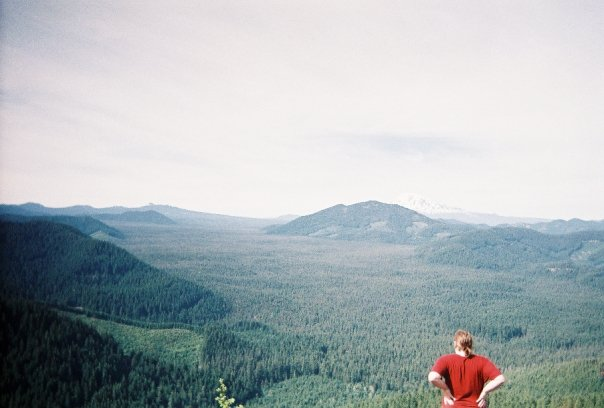

# _Noah Gottlieb's Portfolio_
### Created By _Noah Gottlieb_

## Description

This project demonstrates my strengths as a developing junior programmer. Over the past four months i went from having the very basic knowledge of a handful or languages and frameworks to feeling comfortable building web applications that incorporate user authentication and admin routing for example.

## My Strengths
##### As a programmer
  * If I have an idea for my application and am not sure how i am going to implement it I can research and find the correct fit to full fill my need. I gained this talent from my years researching and writing History papers when i was in college completing my BA in History. I love research and correct researching habits is a must for any programmer. I might not know right away how to implement a new feature but i will find out!

  * While i love building web applications I also enjoy making a website that looks appetizing. A website can have really impressive applications but if it isn't easily accessible and have style users will move on to a different application that does. I have taken on learning SASS to creating a stylized site that integrates applications and looks `cool`.

  * One aspect that i would like to demonstrate with my portfolio site is using ActionMailer for users or potential clients to contact me. This functionality is found in nearly every business's website and i would like to take on the challenge of implementing it into my portfolio page.
  
##### As a person
  * One of my passions is `cooking!` I love to push myself and find new recipes to conquer and more often than not they end up being delicious. I following steps that allow me improvise on them and create something unique that i can share with friends. Not too different from programming! One of the sites that i love to go to to get inspiration is [`Cooks Illustrated`](https://www.cooksillustrated.com/). You have to have an account to access their recipes but they still have great information that is accessible.

  * I love a good Reuben Sandwich! My father grew up in New York City and i have family that still lives there. When visiting my family I love I always on my go to [`Katz's Delicatessen`](https://www.katzsdelicatessen.com/) and get there Reuben sandwich. In Portland one of my favorites is from Goose Hollow Inn. It's a traditional Reuben but is very good. [`Goose Hollow Inn`](https://www.goosehollowinn.com/) has been a staple for since 1967. Even when i'm not hungry i like to stop in and grab a pint and catch up with friends.

  * Growing up in Portland it is hard to not love the outdoors. I grew up with Boy Scouts being a large part of my life. I learned a lot about self-reliance and being mindful of others and my environment. One of my favorite camping spots is on the Oregon coast. [`Camp Meriwether`](https://www.google.com/maps/place/Camp+Meriwether,+BSA/@45.3214613,-123.9549091,15z/data=!4m12!1m6!3m5!1s0x0:0xedf96648c1db171f!2sCamp+Meriwether!8m2!3d45.3275865!4d-123.9426353!3m4!1s0x54ead91d9de70711:0x7f8afdebe998adb3!8m2!3d45.3169542!4d-123.9624926) was one of my favorites! Outside of the scouts i love hiking the in the Mt. Hood area. Heres one of my favorite pictures from my hikes.

  

## Setup

1. open terminal navigate to desired download location (ex. `cd desktop`) and enter:  `git clone https://github.com/ngottlieb87/marios_specialty_foods`

2. Navigate to the root of the project directory and enter the following commands in the terminal:
  * `bundle install`
  * `rake db:create`
  * `rake db:migrate`
  * `rake db:test:prepare`
  * `rake db:seed`

3. To launch the application type the command while in the root directory:
   `rails s`

4. Use your favorite browser and in the url type: `localhost:3000`

## Languages/Frameworks Used:

  ###### _Ruby on Rails, Ruby, ActiveRecord, PSQL, SCSS, Bootstrap_
